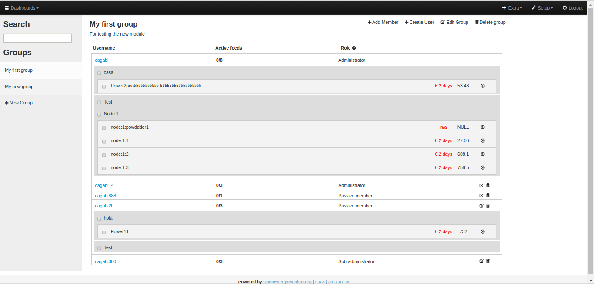
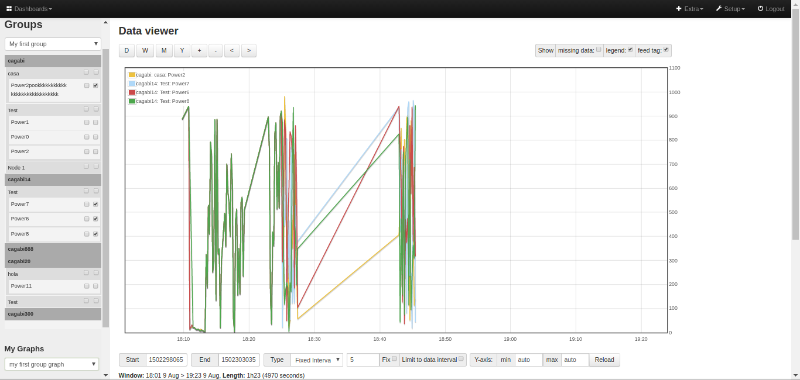

# Groups module

**Status:** beta (testing)

An emonCMS module that allows a single user to manage several user accounts from a single interface. The admisnitrator of a group can add members to it and manage them. 
This is not global administration for all users of an emonCMS installation (for which there is a basic implementation inbuilt in emoncms already).

## Installation
As any other module: clone this repository in the Modules directory of your emonCMS installation and update database.
You also need to update your emonCMS from here: [emonCMS with Group Module support](https://github.com/carboncoop/emoncms/tree/user_tags)

## Features
- Create groups
- Create a new user and add it to group (administrator has full access to new user's account)
- Add existing emonCMS user to a group providing username and password  (administrator has full access to user's account)
- Log into a group member's account with one click (and log back to original user)
- Browse group member's feeds sorted by tag
- One click csv download of selected group member's feeds
- One click graph visualisation of selected group member's feeds
- Edit user info
- Added "tags" to user info to help categorize and add an extra level of grouping. An example of a tag could be "Heat Pump model", this can be added to a user and specify as its value the name of the HP. The UI helps reuse tag names in groups
- Search functionality: looking for a word in user names, group names and user tags

## Roles
- Administrator: full access (create users, add member, create group graphs, etc)
- Sub-administrator: access to the list of members and group graphs
- Passive member: no access to group. The aim of the user is to be managed by the group administrator

## Graph module with Group support
In order to display feeds from different members of a group in a graph you need to install the Graph module with Group support in [development branch of graph module in CarbonCoop](https://github.com/carboncoop/graph/tree/develop)

## Future developments (who knows when)
- Add member to group with username and token (admnistrator can see and use user's feeds but has not got full access to his/her account)
- Group search functionality: groups can be "public" or "private" and therefor are searchable or not
- Join request: groups can be "open" (users can joing then without request) or "closed" (to join a user hast to request it and relevant token is sent to an administrator)