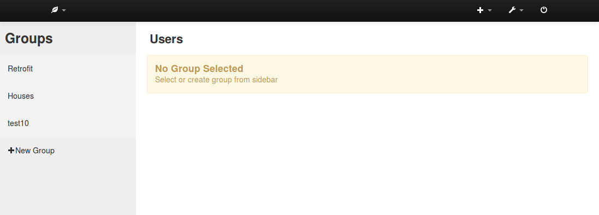
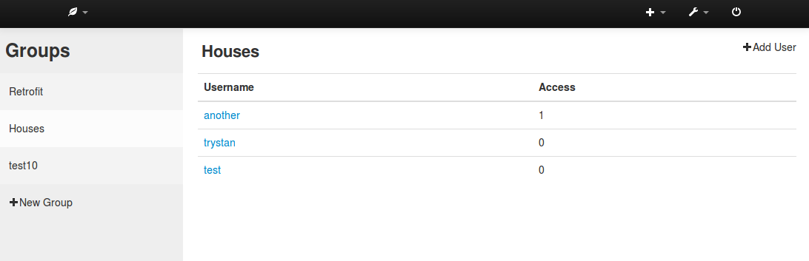

# Groups module

Status: Prototype v1 in development

Multi-user administration module.

Administration and groups for multiple emoncms accounts on emoncms.org or other muti user emoncms installation. Providing administrator access to specific users/groups rather than global administration for all users – for which there is a basic implementation inbuilt in emoncms already.

Concept design:

Screenshots:

## API

**emoncms/group/create?name=NAME&description=DESCRIPTION**

Result:

    {"success":true,"groupid":1,"message":"Group 1 added"}
    
**emoncms/group/adduserauth?groupid=1&username=USERNAME&password=PASSWORD&access=0**

*Access:* 1: Add user as administrator. 0: Add user without administration access.

Result:

    {"success":true,"message":"User 1:USERNAME added"}

**emoncms/group/grouplist**

Result:

    [
        {"groupid":1,"name":"Heatpumps","description":"Heatpump installations"},
        {"groupid":2,"name":"Retrofits","description":"Retrofit projects"}
    ]
    
**emoncms/group/userlist?groupid=1**

Result:

    [
        {"userid":1,"username":"House1","access":1},
        {"userid":2,"username":"House2","access":0}
    ]
