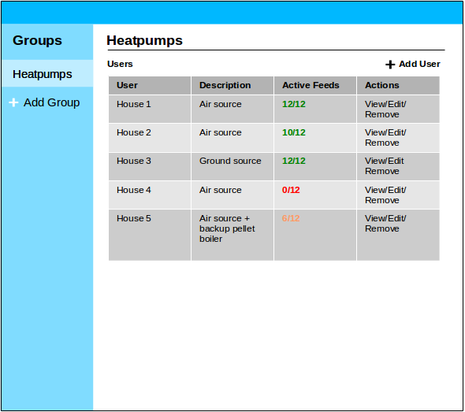

# Groups module

Status: Prototype v1 in development

Multi-user administration module.

Administration and groups for multiple emoncms accounts on emoncms.org or other muti user emoncms installation. Providing administrator access to specific users/groups rather than global administration for all users – for which there is a basic implementation inbuilt in emoncms already.

**A group:**

- Types of installation: "Air source heatpumps", "Solar + battery systems"
- Particular research project, e.g "Heatpump Study", "Retrofit study"
- A group of users wishing to compare energy use and generation

Concept design:

Screenshots:

**Use case 1:** An installer of heatpumps, solarpv etc who is monitoring 10-100s of installations, across many sites, providing remote assistance and fault checking.

An administration module would allow an initial emoncms user to add users to their administrator view. Making it possible to remotely manage multiple accounts without logging into each account individually.

**Use case 2:** A research project monitoring 10-100s of sites. Requiring site status check’s to ensure monitoring is all operating ok. Alerts to signal a system going offline or measurement going outside of expected range. 

Advanced multi site data export tools for further data analysis

**Use case 3:** A group of interested users in a community energy project who want to compare energy use and generation in a group as well as doing a level of consumption and generation aggregation.

There could be in this case a group administrator and then users which are members of the group. There would be specific access permissions for each user type so that such a group administrator may not have access to individuals detailed data but have access to summaries and aggregation.

## API

**emoncms/group/create?name=NAME&description=DESCRIPTION**

Result:

    {"success":true,"groupid":1,"message":"Group 1 added"}
    
**emoncms/group/adduserauth?groupid=1&username=USERNAME&password=PASSWORD&access=0**

*Access:* 1: Add user as administrator. 0: Add user without administration access.

Result:

    {"success":true,"message":"User 1:USERNAME added"}

**emoncms/group/grouplist**

Result:

    [
        {"groupid":1,"name":"Heatpumps","description":"Heatpump installations"},
        {"groupid":2,"name":"Retrofits","description":"Retrofit projects"}
    ]
    
**emoncms/group/userlist?groupid=1**

Result:

    [
        {"userid":1,"username":"House1","access":1},
        {"userid":2,"username":"House2","access":0}
    ]
    
## Todo

**V1:** Basic groups, administrative user access and active feeds monitor

- Edit group name and description
- Edit user access

**V2:** User stats 

Implement ability to show either: 
  - a selected real-time feed value in the user list
  - an average or total e.g: average temperature in the last day, kwh in the last day
  - a calculation e.g: heat kwh last day / electric kwh last day, perhaps implemented as available calculations that are pre-written: e.g: heatpump COP (which would then look for feeds following a naming convention in each users account).

**V3:** Basic notifications

- Implement inactive feeds email notification
- Implement alerts based on feed values and calculations e.g alert if COP over last week is below 2.0.

**V4:** Reports

Perhaps an integration with a dedicated reporting module, ability to send custom reports to users of installation performance etc. Or reports to administrators of overall group/project status

